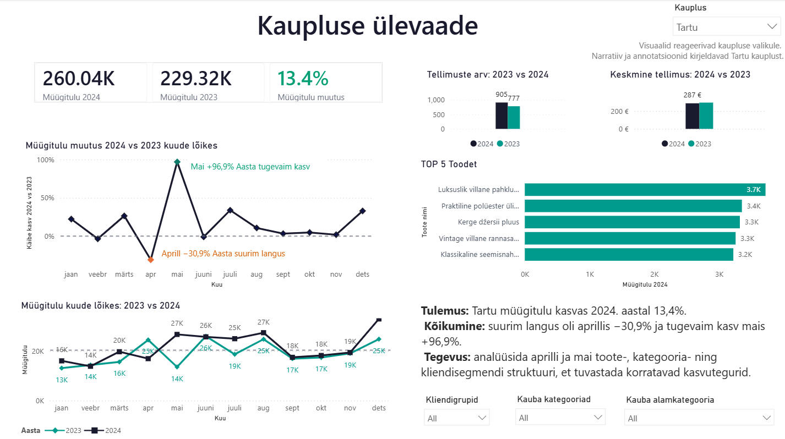

# Nädal 6: visualiseerimise andmed — Tartu kaupluse dashboard

## Eesmärk

Viimistleda Nädal 5 Power BI prototüüp asukohapõhiseks juhtimisvaateks, mis ühendab Tartu kaupluse peamised tulemusnäitajad, kuised trendid, toodete võrdluse ja lühikese andmeloo.

## Minu roll

Minu ametlik roll grupitöös oli **Roll B — Tartu kaupluse dashboard ja narratiiv**. Koostasin Power BI-s individuaalse Tartu juhtimisvaate, mis oli sisendiks meeskonna W6 koondtööle.

## Peamised tulemused

- Tartu 2024. aasta müügitulu oli **260 044,23 eurot**, võrreldes 2023. aasta **229 316,99 euroga**; kasv oli **13,4%**.
- Tellimuste arv suurenes **777-lt 905-le** ehk **16,5%**, samal ajal kui keskmine tellimus vähenes ligikaudu **295,13 eurolt 287,34 eurole**.
- Müügitulu kasvas üheksal kuul kaheteistkümnest. Suurim langus oli aprillis (**−30,9%**) ja tugevaim kasv mais (**+96,9%**).
- TOP 5 toodete 2024. aasta müügitulud jäid ligikaudu **3,2–3,7 tuhande euro** vahele, mistõttu ei domineerinud üks toode ülejäänute ees selgelt.

## Järeldus

Tartu aastakasvu peamine allikas oli suurem tellimuste arv, mitte keskmise ostukorvi kasv. Edasises analüüsis tuleks võrrelda aprilli languse ja mai kasvu toote-, kategooria- ning kliendisegmendi struktuuri, et eristada ajutist kõikumist korratavatest kasvuteguritest.

## Kasutatud oskused ja tööriistad

- Power BI Desktop ja DAX-mõõdikud
- kuupõhine 2023–2024 võrdlus
- KPI-kaardid, joone- ja tulpdiagrammid
- kauplusefilter, annotatsioonid ja viitejooned
- andmeloo ning juhtimissoovituse koostamine
- värvipimedatele sobiv ja järjepidev värvikasutus

## AI kasutamine

AI-d kasutasin õppematerjalide ja nõuete mõtestamisel, DAX-mõõdikute ning Power BI seadistuste kontrollimisel, dashboard'i kujundusotsuste läbivaatamisel ja dokumentatsiooni vormistamisel; lõplikud arvud ja järeldused kontrollisin PBIX-faili ning kuvatõmmise põhjal.

## Artefaktid

- [Power BI dashboard](urbanstyle_week6_tartu_dashboard_helen.pbix)
- [Detailne analüüs](analysis.md)
- [Dashboard'i kuvatõmmis](screenshots/w6_role_b_tartu_kaupluse_dashboard.png)
- [Minu väljund meeskonna W6 repos](https://github.com/Kolju3/DACA-group/tree/main/week-6/individual/helen)

