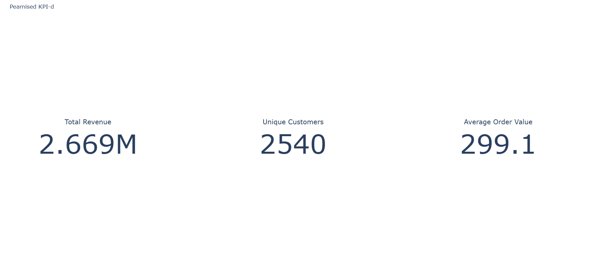
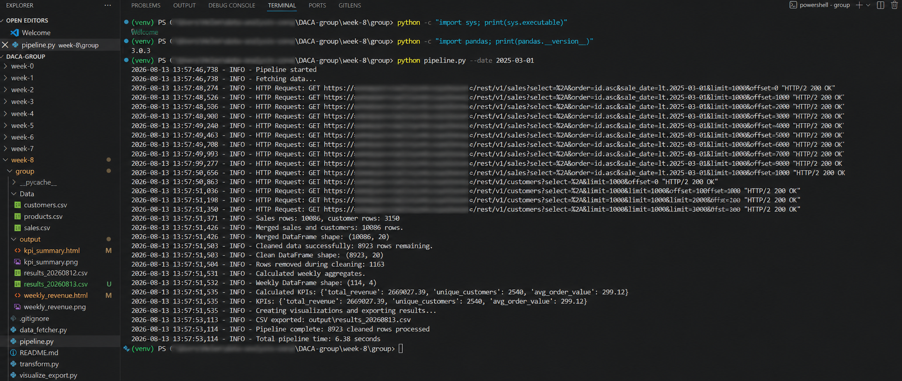

# Nädal 8 — Python API-d ja automatiseeritud pipeline

## Eesmärk

Koostada UrbanStyle'i andmetele modulaarne automatiseeritud pipeline, mis pärib andmed Supabase API-st, töötleb need pandas'ega, loob visualiseeringud ja väljundfailid ning käivitub ühe käsuga.

## Meeskonna rollid

| Roll | Vastutaja | Fail | Vastutus |
|---|---|---|---|
| **A — API Query** | Kalju | [`data_fetcher.py`](data_fetcher.py) | Müügi-, kliendi- ja tooteandmete pärimine, kuupäevafilter, pagination ja veakäsitlus |
| **B — Data Processing** | Natalia | [`transform.py`](transform.py) | Andmete ühendamine ja puhastamine, nädalased koondid ning KPI-d |
| **C — Visualization + Saving** | Olga | [`visualize_export.py`](visualize_export.py) | Plotly visualiseeringud ning CSV- ja HTML-väljundid |
| **D — Automation Script** | Helen | [`pipeline.py`](pipeline.py) | Moodulite ühendamine tervikpipeline'iks, logimine, veakäsitlus ja käivituse ajamõõtmine |

## Integratsioon ja valideerimine

Meeskond kontrollis rollide A–D väljundid järjest läbi ning käivitas tervikpipeline'i algusest lõpuni.

- **Roll A:** kontrolliti API päringuid, kuupäevafiltrit, pagination'it ja võtmete unikaalsust.
- **Roll B:** kontrolliti, et transformatsioonid võtavad Roll A väljundi korrektselt vastu ning puhastuse, koondite ja KPI-de tulemused klapivad lähteandmetega.
- **Roll C:** kontrolliti, et Roll B väljundist tekivad õiged CSV- ja HTML-failid ning visualiseeringud avanevad brauseris.
- **Roll D:** kontrolliti A → B → C → D tervikvoogu, logimist, veakäsitlust ja kuupäevaparameetriga käivitamist.

Kuupäevafiltriga valideeritud jooks:

```powershell
python pipeline.py --date 2025-03-01
```

| Kontroll | Tulemus |
|---|---:|
| Müügiridu | 10 086 |
| Puhastatud ridu | 8 923 |
| Nädalaid | 114 |
| Kogukäive | 2 669 027,39 € |
| Unikaalseid kliente | 2 540 |
| Keskmine ostusumma | 299,12 € |

`--date 2025-03-01` tähendab kasutatud loogikas müüke enne 01.03.2025 ehk kuni 28.02.2025.

# Väljundid

### Nädalane tulu


### KPI kokkuvõte



### Pipeline'i käivituse valideerimine

Pipeline'i tervikvoog valideeriti kuupäevafiltriga:

`python pipeline.py --date 2025-03-01`

Käivitus kinnitas, et andmete pärimine, ühendamine, puhastamine, nädalaste koondite ja KPI-de arvutamine ning väljundite loomine toimivad ühe tervikliku töövoona.



## Failid

```text
week-8/group/
├── data_fetcher.py
├── transform.py
├── visualize_export.py
├── pipeline.py
├── Data/
│   ├── sales.csv
│   ├── customers.csv
│   └── products.csv
├── output/
│   ├── kpi_summary.html
│   ├── kpi_summary.png
│   ├── pipeline_execution_validation.png
│   ├── results_20260812.csv
│   ├── weekly_revenue.html
│   └── weekly_revenue.png
├── .gitignore
└── README.md
```

`Data/` kaustas olevad CSV-failid võimaldavad kasutada lokaalset fallback'i, kui Supabase päring ebaõnnestub. Supabase ühendusandmed hoitakse lokaalses `.env` failis ja neid GitHubi ei lisata.

## Käivitamine

Kogu saadaoleva andmestikuga:

```powershell
python pipeline.py
```

Kuupäevapiiranguga:

```powershell
python pipeline.py --date 2025-03-01
```

## Töökindlus ja piirang

CSV fallback'i toimimist kontrolliti eraldi ning pipeline jõudis lokaalse andmeallikaga lõpuni. Praeguses versioonis on `--date` filter valideeritud Supabase päringul; CSV fallback loeb kogu lokaalse müügifaili.

## AI kasutamine

AI-d kasutati eelkõige veaotsingu, pagination'i kontrollimise ja integratsioonitestide toetamiseks. Kõik olulised parandused ja lõpptulemused kontrolliti reaalse pipeline'i käivituse, ridade arvu, võtmete unikaalsuse ja KPI-de võrdlemisega.
